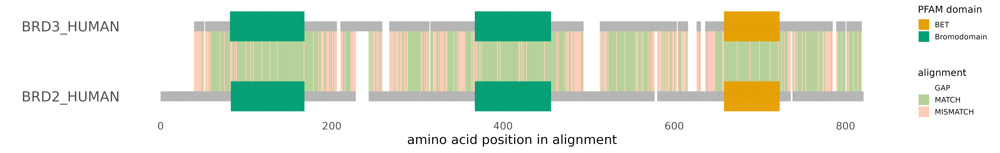

# The drawing that should  be a graph

{width=30%}

When using drawings instead of graphs, almost always, you will loose information in the drawing that is contained in the underlying data (as simplification is often the point of using drawings in the first place). This tutorial is an example of this dilemma, where I first wanted to make an illustration showing the similarity between two proteins, but then decided this could, and should in fact be, a graph. 

While there are probably a thousand ways to visualise protein alignments already out there, I could not find one that was simple enough for an introductory slide so I decided to make my own. I wanted to be able to see in one view you where two proteins diverge in sequence and how this relates to the location of their functional domains. While you can of course show a domainogram of two proteins and just say "they are most conserved within their functional domains " , or "domain X is not conserved but domain Y is", you can also actually visualise this! And for me this made it actually also much more clear for myself. 

***

{width=150%}


***

# Outline

## Description

In this markdown I am generating plots where you can see the alignment between two homologous proteins (BRD2 and BRD3, both human) as well as their functional domains, to get visual insight into whether they diverge or are more similar in their domains than in the rest of the protein. 

This actually consists of 3 steps. 
1. Creating the protein alignment from the sequences
2. Downloading the domain annotation per protein (i.e. what are their domains called and where are located in each protein)
3. Visualising the alignment and domain annotation (merging the two bits of information together)

## Input

For this R notebook I downloaded two protein sequences as .fasta format (brd_human.fasta). 
I copied the functional domain annotation from the Pfam database. (functional_domains.txt) 

For the functional domain annotation I copied both PFAM tables for each respective protein to Excel, where I added a column indicating which of the two proteins that specific functional domain concerned. I only left the domains that were present in both proteins, but this is not necessary. I also removed all domains I'm not interested in (i.e. "unstructured regions" etc). For accessing the PFAM entry for a specific protein, you can use the UniProt ID. 
For BRD2 this was http://Pfam.Pfam.org/protein/Q15059 . You can of course use any domain database. I've made an extra column for the protein concerned (see the excel file as example.)


# Preparing the workspace


```{r eval=FALSE, message=FALSE, warning=FALSE, include=FALSE}
# install packages

if (!require("BiocManager", quietly = TRUE))
    install.packages("BiocManager")

BiocManager::install("msa")


install.packages("ggnewscale")
```

Loading required libraries
```{r load libraries, message=FALSE}


library(seqinr)
library(stringr)
library(tidyverse)
library(ggrepel)
library(gridExtra)
library(reshape2)
library(ggpubr)
library(msa)
library(ggnewscale)

options(bitmapType = 'cairo')

```

Define colors used for plot

```{r set colors, fig.height=3}

cbPalette_Grey <- c("#999999", "#E69F00", "#56B4E9", "#009E73", "#F0E442", "#0072B2", "#D55E00", "#CC79A7")

cbPalette <- c( "#E69F00",  "#009E73","#56B4E9", "#F0E442", "#0072B2", "#D55E00", "#CC79A7")

ggplot(data = data.frame(x = factor(1:length(cbPalette)), y = "a"), aes(x = x , y = y)) + geom_tile(aes(fill = x)) + scale_fill_manual(values = cbPalette)+ theme_classic2()
```


# compute sequence alignment

I'm using clustal omega for a sequence alignment using the msa package. (this is what Benchling uses as well). I'm extracting the protein sequences after alignment, together with the initial protein names. 
What is very important from these resulting protein sequences is that they are the same length (as they have been aligned). This is visible from the dashes, indicated gaps, compared to the other sequence.

## Clustal omega alignment

```{r seq alignment}
sequences <- readAAStringSet("brd_human.fasta")

alignment <- msa(sequences, "ClustalOmega")


protein_names <- names(alignment@unmasked)

protein_1 <- paste0(alignment@unmasked[1])

protein_2 <- paste0(alignment@unmasked[2])

protein_2

```


## create scores

So I now know how these proteins are optimally aligned, and I want to score each amino acid in the alignment, whether it is a gap, a match, or a mismatch.  
In the following part, for each position i in the alignment, I'm calling whether this is a gap ( if one of the proteins have a "-" at that position), a match( no gap, and the amino acid is the same), or a mismatch (no gap, amino acid is not the same). 

```{r score sequence alignment}
nchar(protein_1) == nchar(protein_2)

score_vec <- c()

for(i in c(1:nchar(protein_1))){
  if(substr(protein_1, i,i)== "-" | substr(protein_2,i,i) == "-"){
    score_vec = c(score_vec, "GAP")
  }
  
  
  else if(substr(protein_1,i,i)==substr(protein_2,i,i)){
    score_vec = c(score_vec, "MATCH")
  }
  
  else{score_vec = c(score_vec, "MISMATCH")}

}
```

Using the scorevector, I'm making a dataframe containing the aligned protein sequences. Each row is 1 amino acid in the alignment


```{r sequence alignment to dataframe}
alignment_frame <- data.frame( protein_1 = unlist(strsplit(protein_1, "")), 
                               protein_2 = unlist(strsplit(protein_2, "")), 
                              identity = score_vec, alignment_pos = 1:length(score_vec))


head(alignment_frame)
```


I now need to incorporate the position of each protein into the alignment dataframe. For example, with this alignment

```
protA   MM-KM
        || *|
protB   MMLSM
```
This alignment is 5 AAs long, but the position in protA at the end is only position 4, as there is a gap in the alignment. This is important for the correct annotation of the domains, as I have the domain location only for the original protein position, and not for the alignment position (obviously). So this hypothetical alignment should result in the following dataframe:

```
alignment_pos   protA   protB   pos_protA   pos_protB
1               M       M       1           1
2               M       M       2           2
3                       L                   3
4               K       S       3           4
5               M       M       4           5
```

Here I make a function to find for each amino acid in each protein its amino acid position. Essentially, it is a counter function that adds a number one higher than the previous number, if the amino acid is not equal to "-", which indicates a gap. 

```{r create alignment position conversion}
find_protein_position <- function(column){
  
  position_vector = c()
  
  for(i in 1:length(column)){
    
    if(column[i] == "-"){
      # if there is a gap, add NA to the position vector
      position_vector <- c(position_vector, NA)
      #print(paste0("it ", i , " branch 1"))
    }
    else{
      # with this if statement im catching the first value that is not NA and setting it to 1
      if(is.null(position_vector)|all(is.na(position_vector))){
        position_vector = c(position_vector, 1)
      #print(paste0("it ", i , " branch 2.1"))
      }
      else{
        # if, at position i, there is no gap and it is not the first AA, then add 1 to the highest value already there
        position_vector <- c(position_vector, max(position_vector, na.rm = TRUE)+1)
      #print(paste0("it ", i , " branch 2.2"))
      }
    }
      
   
  }
  return(position_vector)
  }

alignment_frame$protein_1_position = find_protein_position(alignment_frame$protein_1)

alignment_frame$protein_2_position = find_protein_position(alignment_frame$protein_2)

head(alignment_frame)
```

You can see here that due to the gap in the alignment in protein 2 at the start the counter does not start yet.


Lastly, I need to incorporate the domain annotation  

# load domain data

I downloaded PFAM domain data from the PFAM database, for both BRD2 and BRD3.
You can access the page for a single protein using the UniProt ID to search, or via the UniProt website (click "view this protein on PFAM").
It is very convenient if the names in the protein column are the same as protein_names from the .fasta file.

```{r load functional domains}


domain_annot <- read.table("functional_domains2.txt", header = TRUE)

head(domain_annot)
```

Domain_annot is now in the form: 
```
name        start       end
domainA     3           5

```
whereas I need it to be like this: 
```
position    domain
1
2
3           domainA
4           domainA
5           domainA
6
```

In that way I can merge it with the sequence alignment, where I have the position per protein, and the position in the alignment. When I combine these two I will get the position of the domains in the alignment.

```{r convert domains to long format}


create_long_annotation <- function(function_domain_df){
  
  domain_vec <- c()
  position_vec <- c()
  
  for(i in 1:length(function_domain_df$Domain)){
    
    domain_vec <- c(domain_vec, rep(function_domain_df$Domain[i],
                                    length(function_domain_df$Start[i]:function_domain_df$End[i])))
    
    position_vec <- c(position_vec, function_domain_df$Start[i]:function_domain_df$End[i] )
    
  }
  
  return(data.frame(domain=  domain_vec, position = position_vec))
  
}


domain_annot_protein1 <- create_long_annotation(domain_annot%>%filter(Protein == protein_names[1]))

domain_annot_protein2 <- create_long_annotation(domain_annot%>%filter(Protein == 
                                                                        protein_names[2]))

head(domain_annot_protein1)

```

You can see here that for each domain, I have every protein position that is part of that domain.

I will now merge this with the alignment dataframe, for both proteins.

```{r merge domain annotations and alignment}
alignment_frame <- merge(alignment_frame, domain_annot_protein1, 
                         by.x = "protein_1_position", by.y = "position", all.x = TRUE)

colnames(alignment_frame)[7] = "protein_1_domain" 

alignment_frame <- merge(alignment_frame, domain_annot_protein2, 
                         by.x = "protein_2_position", by.y = "position", all.x = TRUE)

colnames(alignment_frame)[8] = "protein_2_domain"

write.table(alignment_frame, "alignment_dataframe.txt")

alignment_frame <- alignment_frame%>%arrange(alignment_pos)

head(alignment_frame)
```
There are no domains in the N terminus of the proteins, but when filtering for the top domain in the first protein we find this overlapping annotation for the first bromodomain: 

```{r}
head(alignment_frame%>%filter(!is.na(protein_1_domain)))
```


# Plotting the result 

The ggplot code has a lot of layers and I've edited the theme to make the final layout as simple as possible.
It is essentially an XY graph where each object is a square (drawn with geom_rect). The x position is always the position in the alignment. The y coordinate is hidden (it is just for making the outlines of the rectangles) but I've also included a plot below where you can see the coordinates if you want to modify the plot yourself.


```{r plot, fig.width=13, fig.height=2}


ggplot(data = alignment_frame)+
  
  # protein alignment
  geom_rect(aes(xmin = alignment_pos-1, xmax = alignment_pos, ymin = 0.2, ymax = 0.8, fill = identity), 
            alpha = 0.4, color = NA)+
  scale_fill_manual(name = "alignment", values = c("white", "chartreuse4", "coral"))+
  
  
  # new color scale for fill ( to add the proteins with domains)
  new_scale("fill")+
  # protein 1
  geom_rect(data = alignment_frame%>%filter(!is.na(protein_1_position)),
            aes(xmin = alignment_pos-1, xmax = alignment_pos, ymin = 0.1, ymax = 0.2), 
            fill = "grey70", color = NA)+
  geom_rect(data = alignment_frame%>%filter(!is.na(protein_1_domain)),
            aes(xmin = alignment_pos-1, xmax = alignment_pos, ymin = 0, ymax = 0.3, fill = protein_1_domain), 
            color = NA)+
  
  # protein 2
  geom_rect(data = alignment_frame%>%filter(!is.na(protein_2_position)),
            aes(xmin = alignment_pos-1, xmax = alignment_pos, ymin = 0.8, ymax = 0.9), 
            fill = "grey70", color = NA)+
  geom_rect(data = alignment_frame%>%filter(!is.na(protein_2_domain)),
            aes(xmin = alignment_pos-1, xmax = alignment_pos, ymin = 0.7, ymax = 1, fill = protein_2_domain), 
            color = NA)+
  
  # colors for domains
  scale_fill_manual(name  = "PFAM domain", values = cbPalette)+
  

  # theme 
    theme_classic2()+
    theme(panel.border = element_blank(), axis.line = element_line(color = "white"), 
        axis.ticks = element_blank(), 
        axis.text.y = element_text(size = 13), legend.text = element_text(size = 7), legend.title = element_text(size = 9), 
        legend.key.size = unit(0.4, "cm"))+
  # scale and labels
  scale_y_continuous(breaks = c(0.15,0.85), labels = protein_names)+
  xlab("amino acid position in alignment")+ ylab("")


ggsave("protein_alignment.png", width = 13, height = 2, dpi = 500)
  
```

## coordinates for modifying plot

These are the y coordinates used for the different geom layers to make the plot easier to adjust. 
0.15 and 0.85 have not been used here but they are the middle of each protein.

```{r, fig.width=13, fig.height=6}

y_coordinates <- data.frame(y = c(0,0.1,0.15,0.2,0.3,0.7,0.8,0.85,0.9,1), x = rep(0,10), xend = rep(821,10))
y_coordinates$yend <- y_coordinates$y


last_plot() +
  geom_segment(data = y_coordinates, aes(x = x, y = y , xend = xend, yend = yend))+
  scale_y_continuous(breaks = y_coordinates$y)


```


